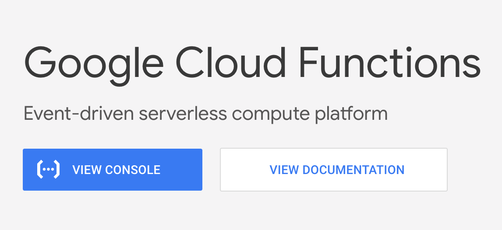
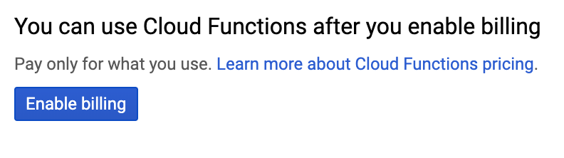

# Long form installation instructions

This guide assumes you have limited knowledge of the
Google Cloud produts.

## Feedback requested!
If you have ideas on how these guides can be improved,
please open an Issue for this repository. Or submit a 
pull request. Thank you.

## Contents
1. Google Cloud account (below)
1. [Provision the Cloud Function](docs/INSTALLATION_2.md)
1. [Provision the Cloud Function](docs/INSTALLATION_2.md)

## 1. Google Cloud account

1. [Login to Google](https://myaccount.google.com/)
1. Open the 
   [Google Cloud Functions](https://cloud.google.com/functions/)
   page.
1. Click the **View Console** button. 
   See figure 1, below.

   
   Figure 1. Click **View Console**

1. Click **Enable billing** as shown in 
   figure 2.

   
   Figure 2. Click **Enable billing**
1. Complete the form for setting up
   billing.

1. Return to the Cloud Functions console.
   (See steps 2 and 3, above.)

Next: [Provision the Pub/Sub Topic](docs/INSTALLATION_2_pub_sub_topic.md)
