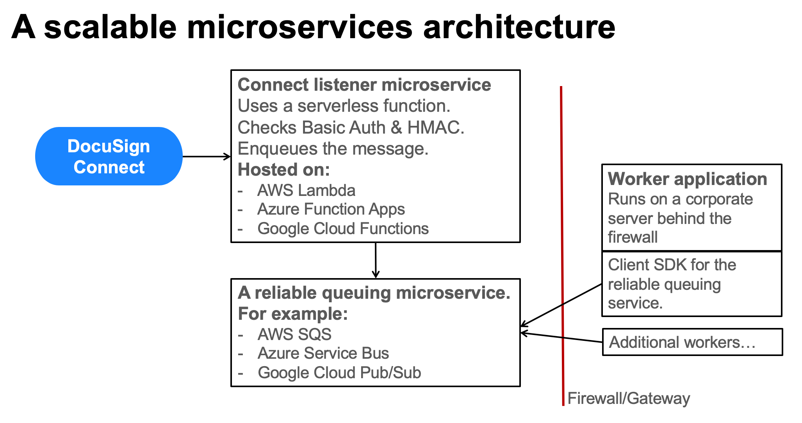

# Connect Node Listener for Google Cloud

This application is a microservice for use with 
[Google Cloud Functions](https://cloud.google.com/functions/).

It acts as a server (a **listener**) for DocuSign
Connect notification messages. After checking the 
message's Basic Authentication and HMAC values,
the software enqueues the message onto a
[Google Cloud Pub/Sub](https://cloud.google.com/pubsub/)
queue for processing by other software apps.

The repo 
[connect-node-worker-gcloud](../../../connect-node-worker-gcloud)
is an example worker application.
It receives messages from the queue
via a 
[Pub/Sub Subscription](https://cloud.google.com/pubsub/docs/subscriber),
and then processes
them. See the repo for more information.

## Architecture

This figure shows the solution's architecture. 
This application is written in Node.js. 
The example worker app is also written in Node.js but 
could be written in a different language.

## Installation

Short form instructions are below. 
[Long form]() instructions are also available.

### Google Cloud Pub/Sub
1. Provision a 
   [Google Cloud Pub/Sub](https://cloud.google.com/pubsub/) **Topic**.

   The `Topic name` is used as a setting for the listener function. 
1. Create a **Subscription** for the topic. 
   The subscription will use **Pull** delivery.

   The `Subscription Name` is used as a setting for
   the worker application.

### Google Cloud Function
1. Provision a Cloud Function with an `HTTP` trigger. 
   Runtime: `Node.js 8`.
1. Deploy the connectListener/index.js and
   connectListener/package.json files to
   the function.
1. Note the URL for the cloud function.
   The Connect subscription will be configured with this URL.
1. Set the environment variables for the function:
   1. **BASIC_AUTH_NAME** optional. The Basic Authentication
      name set in the Connect subscription.
   1. **BASIC_AUTH_PW** optional. The Basic Authentication
      password set in the Connect subscription.
   1. **HMAC_1** optional. The HMAC secret used by the
      Connect subscription.
   1. **TOPIC** required. The Pub/Sub topic name. It will be
      similar to: `projects/xxx/topics/xxxxx`

   The topic's subscription name is used by the 
   worker application.

   The environment values can be set via the 
   Google Cloud console or by using a `.env.yaml` file.
   See the 
   [Environment Variables](https://cloud.google.com/functions/docs/env-var)
   documentation.

## Testing
Configure a DocuSign Connect subscription to send notifications to
the Cloud Function. Create / complete a DocuSign envelope.
Check the Connect logs for feedback.

### Test messages feature
This application and the worker application enable test
messages to be sent via the queuing system. The test
messages do not include XML Connect notification
messages. 

To send a test message, use query parameter `test` set to
a test value, with the function's URL. 

## Usage
**Do not include documents in the notification messages**
The Pub/Sub queuing system will not support messages that
include documents. Check that your Connect subscription
is configured to not include envelope documents nor the
envelope's Certificate of Completion.

## License and Pull Requests

### License
This repository uses the MIT License. See the LICENSE file for more information.

### Pull Requests
Pull requests are welcomed. Pull requests will only be considered if their content
uses the MIT License.

