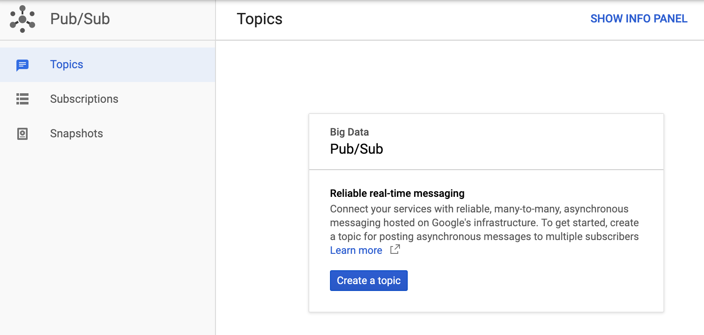
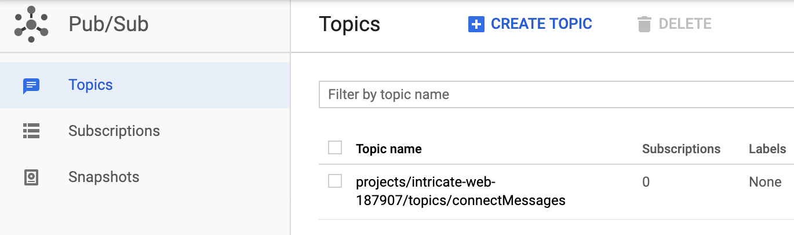

# Provision the Cloud Pub/Sub Topic

#### Summary
At the end of this article, you will have recorded the 
Google Cloud Pub/Sub `Topic Name`. The Topic Name
will be used when you provision the Cloud Function.

#### Steps 

1. Open the 
   [Google Cloud Pub/Sub](https://cloud.google.com/pubsub/)
   page.
1. Click the **View Console** button.
1. Click the **Create a topic** button 
   See figure 1, below.

   
   
   Figure 1. Click **Create a topic**

1. Complete the Topic form with the topic name
   and click **Create** as shown in 
   figure 2.

   
   
   Figure 2. Complete the form and click **Create**
1. After the topic has been created, you will 
   see it listed on your Pub/Sub console.
   See figure 3.
   
   **Record** the full topic name including 
   the project name. The topic name includes 
   `projects` at the beginning.
   
   
   
   Figure 3. The Topics page.

You now have the `Topic Name` for your topic.

Next: [Topic's Subscription](INSTALLATION_3_pub_sub_subscription.md)
