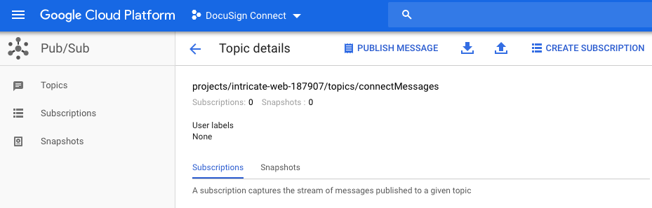
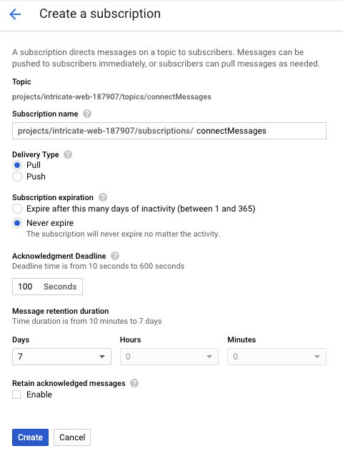
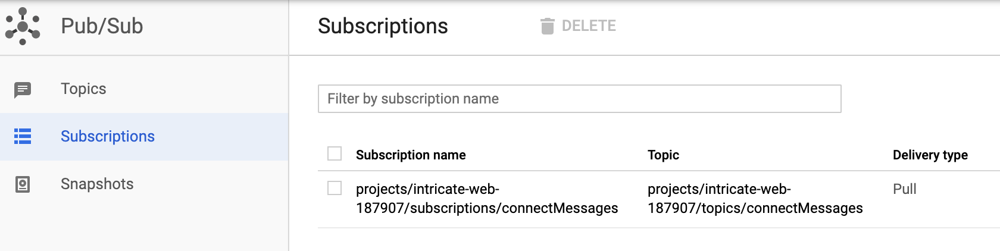

# Provision the Cloud Pub/Sub Subscription

#### Summary
At the end of this article, you will have recorded the 
Google Cloud Pub/Sub Topic's `Subscription Name`. 
The Subscription Name
will be used when you provision your worker application behind
your firewall.

#### Steps

1. Open the 
   [Google Cloud Pub/Sub](https://cloud.google.com/pubsub/)
   page.
1. Click the **View Console** button.

1. In the next steps,
   you will create a subscription for the topic.
   The subscription
   will be used by the worker application to 
   receive messages via the topic queue.
   [Subscriptions documentation](https://cloud.google.com/pubsub/docs/quickstart-client-libraries#create-topic-sub) 

1. On the Topics page, click on your topic. The **Topic details**
   page will be shown. Click the **Create Subscription**
   button (top right) to open a subscription form.
   See figure 1.

   
   
   Figure 1. Click the **Create Subscription** button (top right).

1. Complete the **Create a subscription** form.
   Delivery type is **Pull** to enable the worker application
   to retrieve messages while it is behind a firewall. 
   See figure 2. 

   
   
   Figure 2. Complete the subscription form and click the 
   **Create** button.

1. The subscriptions page is available from the Pub/Sub console home page.
   
   Record the complete `Subscription name`. See figure 3.

   
   
   Figure 3. The Subscriptions page shows the subscription's name and 
   related information.

You now have the `Subscription name`. It is a setting for your 
worker application that will receive and process the notification messages.

Next: [Provision the Cloud Function](INSTALLATION_4_cloud_function.md)
