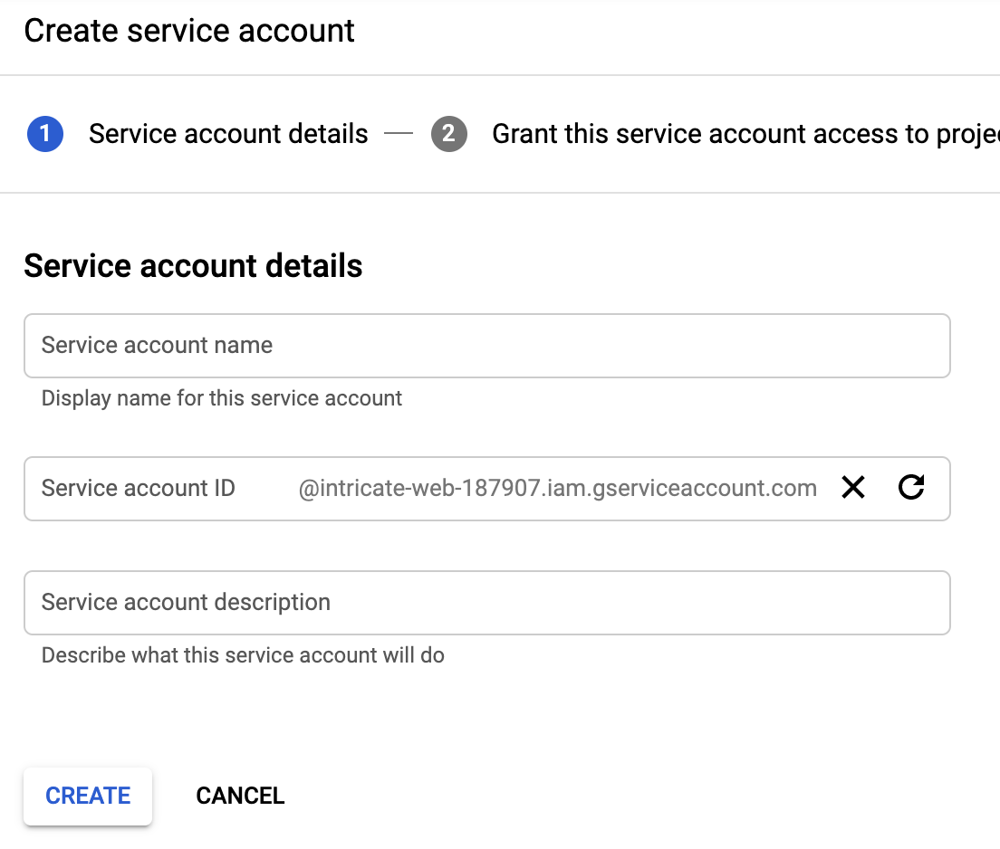
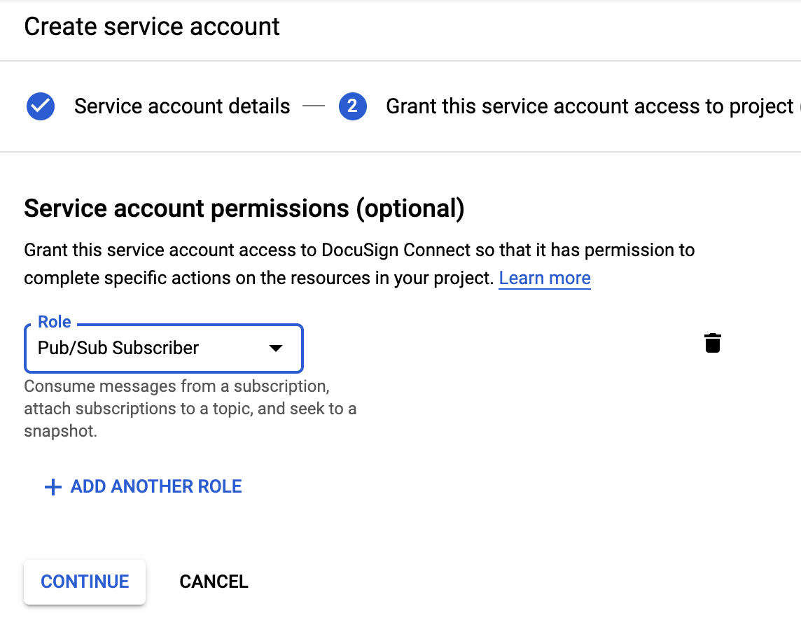

# Create service account credentials

#### Summary
Use this article to create a
Service Account credential file. 
It will be used
with your worker application.

Google 
[recommends](https://cloud.google.com/pubsub/docs/authentication)
that a client of the Pub/Sub service should 
authenticate via a service account.

#### Steps
1. Open the 
   [Google Cloud Service Accounts](https://console.cloud.google.com/iam-admin/serviceaccounts)
   page.
1. At the top of the page, select your current Google 
   Cloud project.
1. Click the **Create Service Account** link near the top
   of the page.
1. The **Create service account** form (part 1) will
   be shown. See Figure 1:

   
   
   Figure 1. Enter a Name and Description for the new
   service account and click **Create**

1. Next, part 2 of the form is shown. Grant the pre-existing 
   role of **Pub/Sub Subscriber** to the service account.
   See figure 2:    

   
   
   Figure 2. Select the **Pub/Sub Subscriber** role and 
   click **Continue**

1. Next, part 3 of the form is shown. See figure 3.

   Skip the optional 
   **Grant users access to this service account** section.

   Click the **Create key** button to download a 
   **JSON** file that includes the credential's 
   private key and related information.

   **Recommendation:** store the JSON credentials file
   you download as `gcloud.json`.
   
   

   Figure 3. Click **Create key** to download the credentials
   file.

## Next steps

For your worker application, set the 
environment variable `GOOGLE_APPLICATION_CREDENTIALS`
to the name of the credentials fils, eg `gcloud.json`

The Google Cloud SDK will read the environment
variable and the file it points to for the authentication
credentials it will use.

See the SDK library documentation on 
[Setting up authentication](https://cloud.google.com/pubsub/docs/reference/libraries#setting_up_authentication).